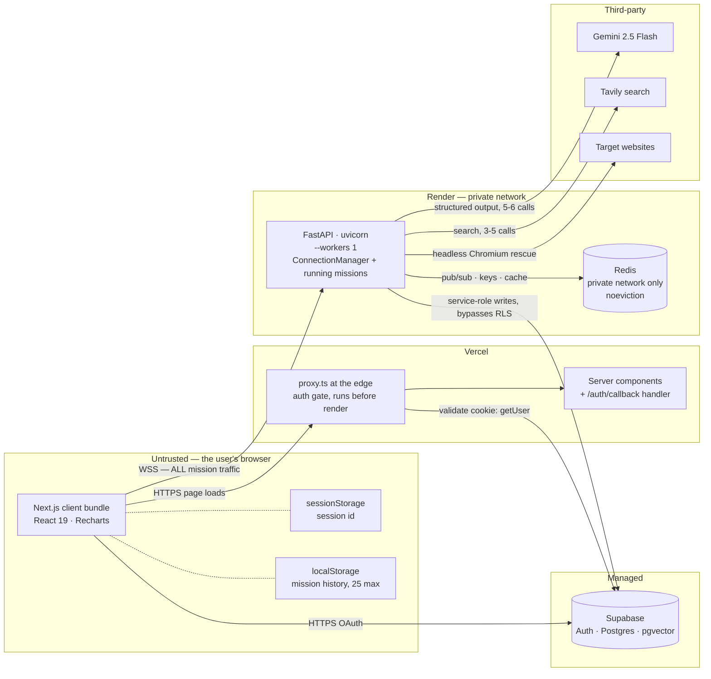
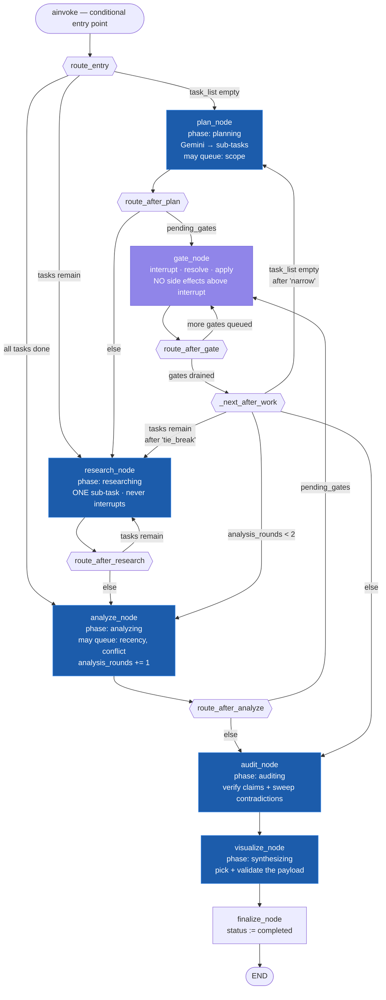
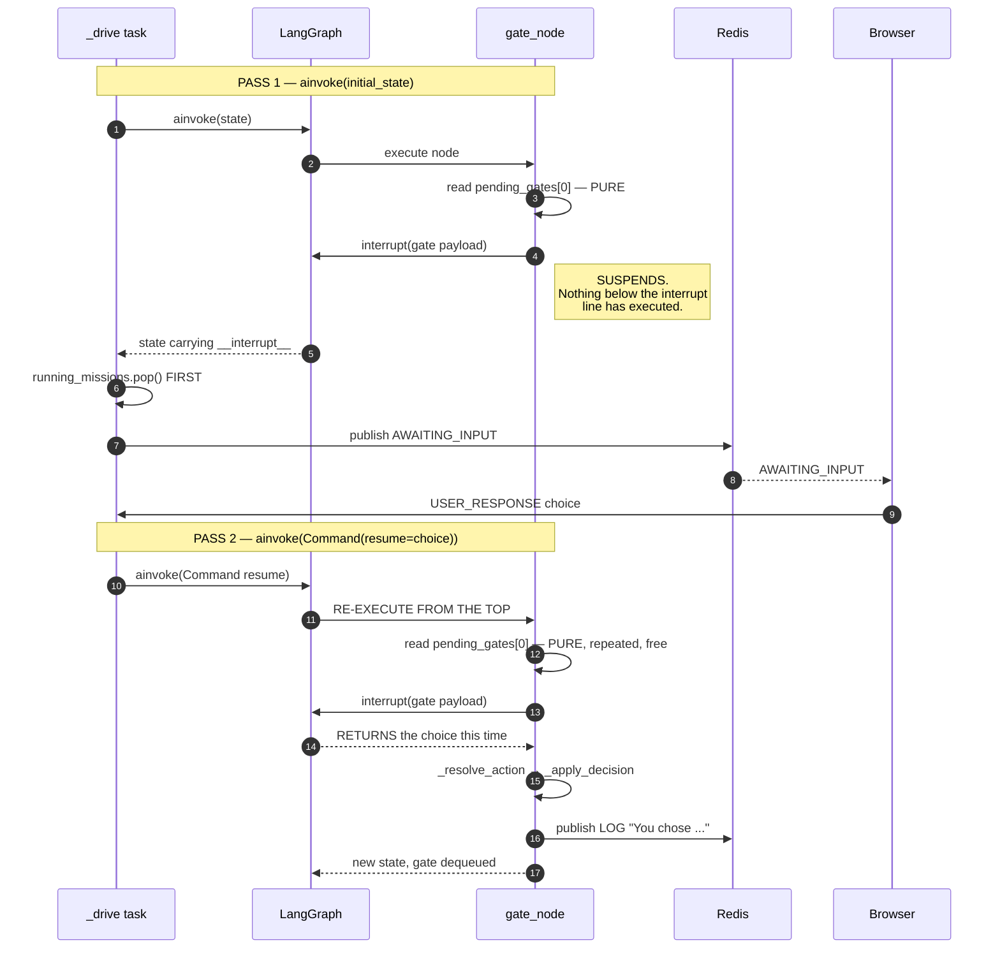
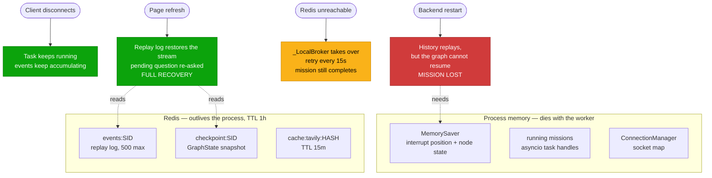
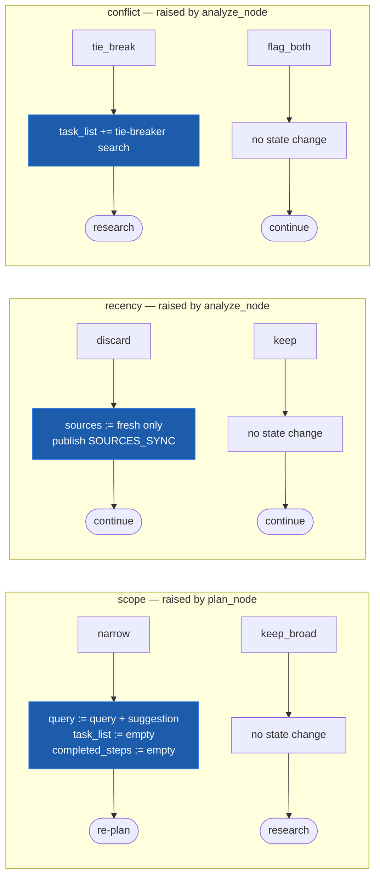
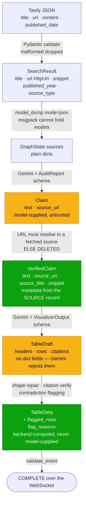
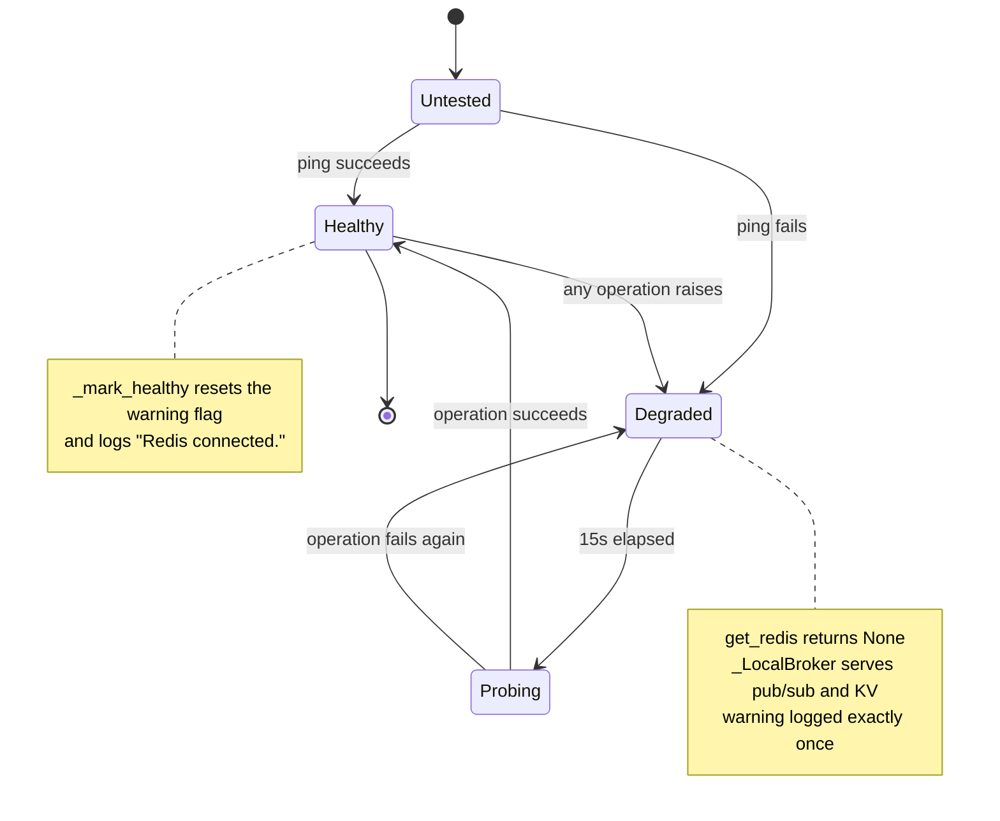
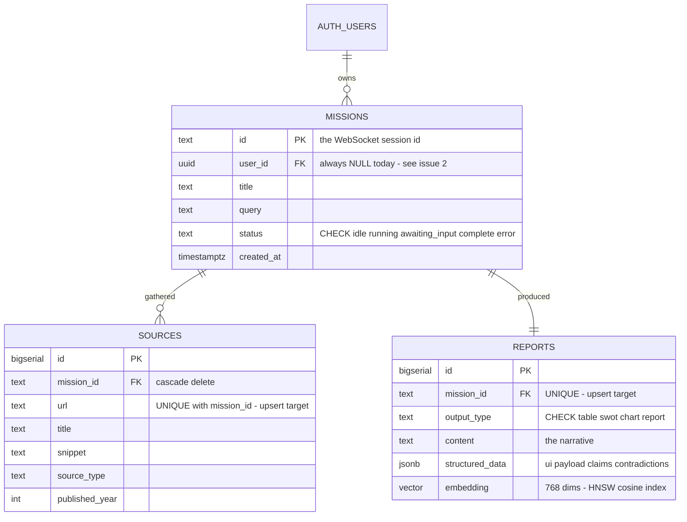
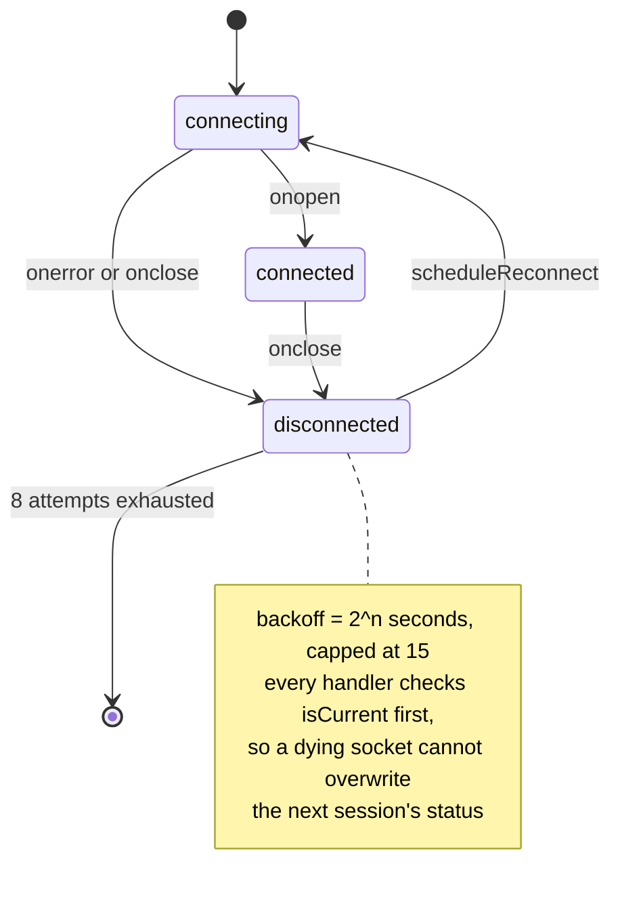
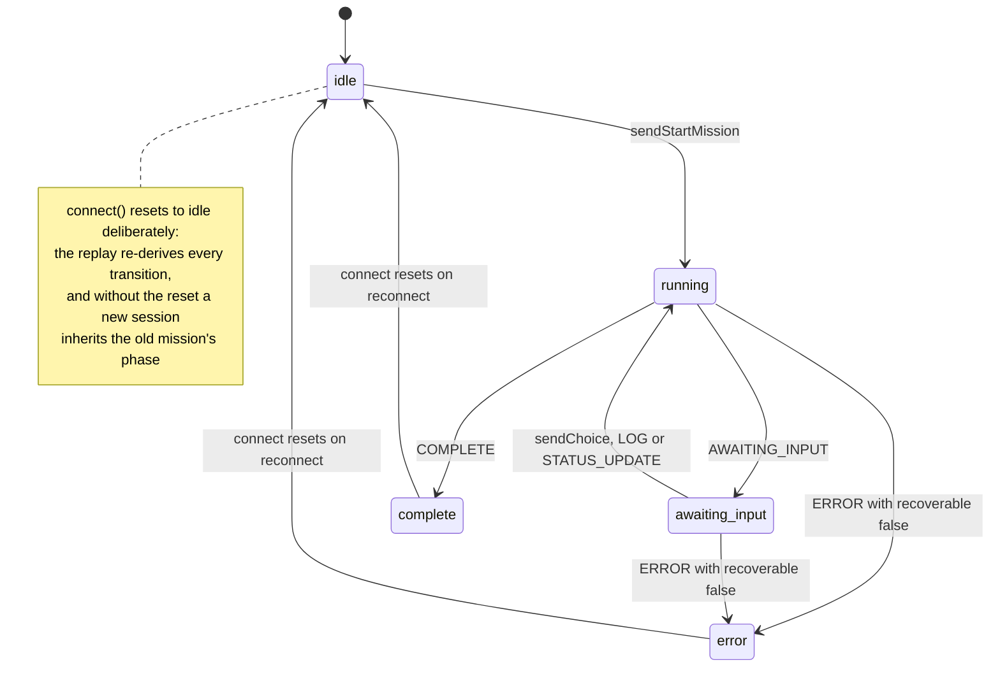

# Aletheia — Technical Architecture

A complete engineering reference for the system: what every layer does, how the
pieces talk to each other, why the non-obvious decisions were made, and where
the sharp edges are.

> This document describes the code as it stands on `main` (`153f395`). Where a
> design has a known gap, it is stated plainly in [§17](#17-known-limitations--open-issues)
> rather than glossed over.

---

## Table of contents

1. [What Aletheia is](#1-what-aletheia-is)
2. [System topology](#2-system-topology)
3. [Repository layout](#3-repository-layout)
4. [Integration & data flow](#4-integration--data-flow)
5. [Lifecycle of a mission](#5-lifecycle-of-a-mission)
6. [Transport layer — FastAPI](#6-transport-layer--fastapi)
7. [Orchestration — the LangGraph state machine](#7-orchestration--the-langgraph-state-machine)
8. [Human-in-the-loop: the ambiguity junctions](#8-human-in-the-loop-the-ambiguity-junctions)
9. [The agent layer](#9-the-agent-layer)
10. [The verification architecture](#10-the-verification-architecture)
11. [Contracts — schemas and the wire protocol](#11-contracts--schemas-and-the-wire-protocol)
12. [Services layer](#12-services-layer)
13. [Persistence and the data model](#13-persistence-and-the-data-model)
14. [Frontend architecture](#14-frontend-architecture)
15. [Design system and accessibility](#15-design-system-and-accessibility)
16. [Failure modes and degradation](#16-failure-modes-and-degradation)
17. [Known limitations & open issues](#17-known-limitations--open-issues)
18. [Configuration reference](#18-configuration-reference)
19. [Deployment](#19-deployment)
20. [Testing](#20-testing)
21. [Quick reference](#21-quick-reference)

### Diagrams

| # | Diagram | Shows | In |
|---|---|---|---|
| 1 | Deployment topology | processes, trust zones, every network hop | [§2](#2-system-topology) |
| 2 | Mission lifecycle | the full request/response sequence, OAuth to `COMPLETE` | [§5.1](#51-sequence) |
| 3 | Decision-gate race | the buggy vs fixed interleaving, side by side | [§6.3](#63-_drive--the-mission-driver) |
| 4 | The agent graph | all 7 nodes, 6 routing functions, every edge predicate | [§7.2](#72-the-graph) |
| 5 | Interrupt re-execution | `gate_node` running twice, and why that is safe | [§7.4](#74--the-central-architectural-insight) |
| 6 | Failure survival | what lives through disconnect, refresh, Redis loss, restart | [§7.6](#76-checkpointing--two-independent-mechanisms) |
| 7 | Gate decision effects | each choice → state mutation → routing target | [§8](#8-human-in-the-loop-the-ambiguity-junctions) |
| 8 | Type pipeline | every shape a fact passes through; trusted vs verified | [§11](#11-contracts--schemas-and-the-wire-protocol) |
| 9 | Redis degraded mode | the healthy/degraded/probing state machine | [§12.1](#121-redis--servicesredis_servicepy) |
| 10 | Database schema | tables, keys, upsert targets, the pgvector column | [§13](#13-persistence-and-the-data-model) |
| 11 | Socket lifecycle | connect, reconnect backoff, exhaustion | [§14.2](#142-the-websocket-hook) |
| 12 | Mission phase | how the UI derives state purely from the event stream | [§14.2](#142-the-websocket-hook) |

---

## 1. What Aletheia is

Aletheia takes a research **goal** — not a question — and investigates it.

```
"Compare Apple and Microsoft 2026 ESG carbon targets"
   │
   ├─ decomposes into 3–4 independently-searchable sub-tasks
   ├─ searches the web, validates and de-duplicates every result
   ├─ pauses to ask you when it hits a genuine ambiguity
   ├─ extracts factual claims and deletes any it cannot cite
   ├─ sweeps for contradictions between sources
   └─ chooses the right output shape and renders it, with an audit trail
```

Every step streams to the browser as it happens, so the user watches the agent
think rather than staring at a spinner.

### The governing principle

> **The model proposes; code disposes.**

Every citation an LLM produces is re-verified in Python against the URLs the
Researcher actually fetched. A claim citing a page that was never retrieved is
deleted. A table cell citing an unmatched URL loses its citation. A
contradiction whose two sides resolve to the same source is discarded.

This is what separates a **hallucination check** from *"ask the same model
whether it was right"* — the latter is theatre, because the model that invented
the citation is happy to confirm it.

The same pattern recurs at every level:

| Layer | Model proposes | Code enforces |
|---|---|---|
| Planner | `is_broad` + a narrowing suggestion | vague suggestions (`specific`, `particular`, …) are rejected and the gate is skipped |
| Researcher | raw search hits | Pydantic validation, URL de-duplication, year extraction |
| Auditor | claims tagged with source URLs | every URL must resolve to a gathered source, else the claim is dropped |
| Contradiction | pairs of conflicting claims | both URLs must resolve, and must differ |
| Visualizer | a `ui` choice + payload | shape repair, citation verification, downgrade to `report` if invalid |

---

## 2. System topology

```
┌──────────────────────┐                         ┌────────────────────────┐
│  Next.js 16 (Vercel) │                         │  FastAPI  (Render)     │
│                      │   WebSocket             │  uvicorn --workers 1   │
│  React 19            │◄───────────────────────►│                        │
│  Tailwind v4         │  /ws/research/{sid}     │  ConnectionManager     │
│  Recharts            │                         │  running_missions{}    │
│                      │                         └───────────┬────────────┘
│  proxy.ts (auth)     │                                     │
└──────────┬───────────┘                                     ▼
           │                                    ┌────────────────────────┐
           │ auth cookies                       │  LangGraph StateGraph  │
           ▼                                    │  7 nodes · MemorySaver │
┌──────────────────────┐                        └───────────┬────────────┘
│  Supabase            │                                    │
│  · Google OAuth      │◄───────────────────────────────────┤ service-role writes
│  · Postgres          │                                    │
│  · pgvector (HNSW)   │                        ┌───────────┴────────────┐
│  · Row Level Security│                        │      Agent layer       │
└──────────────────────┘                        │  planner · researcher  │
                                                │  analyst · auditor     │
┌──────────────────────┐                        │  contradiction         │
│       Redis          │◄───────────────────────┤  visualizer            │
│  · pub/sub channel   │   events + checkpoints └───────┬────────┬───────┘
│  · replay event log  │                                │        │
│  · state checkpoints │                    Gemini 2.5 ─┘        └─ Tavily
│  · search cache      │                    Flash                    search
└──────────────────────┘                                            │
                                                                    ▼
                                                       Playwright (optional,
                                                       rescues unreadable pages)
```

### Deployment topology and trust zones



Note what is **absent**: there is no arrow from the browser to Gemini or Tavily,
and none between Vercel and Render. No provider key reaches the client, and the
two server tiers are joined only by the user's browser.

### Component inventory

| Concern | Technology | Version | Required? |
|---|---|---|---|
| UI | Next.js App Router, React, Tailwind v4 | 16.2.4 / 19.2.4 | yes |
| Charts | Recharts | ^3.10 | yes |
| API / transport | FastAPI + uvicorn (`websockets`) | — | yes |
| Orchestration | LangGraph `StateGraph` + `MemorySaver` | ≥1.0 | yes |
| Reasoning | Gemini 2.5 Flash (`google-genai`), structured output | — | **yes** |
| Web search | Tavily REST API | — | **yes** |
| Streaming / state | Redis (async client) | ≥5.0 | recommended |
| Auth | Supabase Google OAuth (`@supabase/ssr`) | — | for auth |
| Long-term memory | Supabase Postgres + pgvector | — | optional |
| Page rescue | Playwright + Chromium | ≥1.40 | optional |

Anything marked *optional* degrades cleanly and says so in the startup log. See
[§16](#16-failure-modes-and-degradation).

---

## 3. Repository layout

```
aletheia/
├── backend/
│   ├── main.py                    FastAPI app, WebSocket endpoint, mission driver
│   ├── graph/
│   │   └── agent_graph.py         The 7-node LangGraph state machine
│   ├── agents/
│   │   ├── planner.py             goal  → sub-tasks + scope judgement
│   │   ├── researcher.py          task  → validated sources (no interrupts!)
│   │   ├── analyst.py             sources → yes/no conflict (gate trigger)
│   │   ├── auditor.py             sources → verified claims  (Node 3)
│   │   ├── contradiction.py       sources → verified contradiction pairs
│   │   └── visualizer.py          claims  → ui + payload      (Node 4)
│   ├── schemas/
│   │   ├── messages.py            WebSocket protocol (the FE/BE contract)
│   │   └── responses.py           LLM output models + wire payloads
│   ├── services/
│   │   ├── llm.py                 Gemini wrapper, structured output, retries
│   │   ├── tavily.py              search + Redis-backed result cache
│   │   ├── redis_service.py       pub/sub · replay log · checkpoints · cache
│   │   ├── supabase_store.py      mission persistence + embeddings
│   │   └── playwright_scraper.py  headless-browser fallback
│   ├── supabase_schema.sql        tables, HNSW index, match_reports(), RLS
│   ├── test_ws.py                 end-to-end integration (real APIs)
│   ├── test_race.py               AWAITING_INPUT/USER_RESPONSE race regression
│   └── test_commit7.py            auditor + visualizer unit suites (stubbed LLM)
│
├── frontend/
│   ├── src/app/
│   │   ├── page.tsx               → redirect('/dashboard')
│   │   ├── dashboard/page.tsx     the single workspace
│   │   ├── login/page.tsx         Google OAuth entry
│   │   ├── auth/callback/route.ts PKCE code → session cookie
│   │   ├── layout.tsx             Inter font, dark class, metadata
│   │   └── globals.css            design tokens + animations
│   ├── src/lib/
│   │   ├── websocket.ts           the socket hook + all TS protocol types
│   │   ├── session.ts             sessionStorage-backed session id
│   │   ├── missions.ts            localStorage mission history
│   │   └── supabase/{client,server}.ts
│   ├── src/components/            11 components (see §14)
│   ├── src/proxy.ts               Next 16 edge auth (route protection)
│   └── middleware.ts              ⚠ legacy duplicate — see §17
│
├── docker-compose.yml             local Redis
├── render.yaml / railway.json     backend blueprints
└── DEPLOYMENT.md / README.md
```

---

## 4. Integration & data flow

Section 3 says where the code lives. This one says **who calls whom, with what,
and where the answer ends up** — the view you need before reading the sequence
trace in [§5](#5-lifecycle-of-a-mission).

### 4.1 The five parties

| Party | Runs where | Talks to | Never talks to |
|---|---|---|---|
| **Browser** | the user's machine | Next.js, FastAPI (WebSocket), Supabase Auth | Gemini, Tavily, Redis |
| **Next.js** | Vercel edge + node | Supabase Auth (cookie validation) | Gemini, Tavily, Redis, FastAPI |
| **FastAPI** | Render, one process | Gemini, Tavily, Redis, Supabase DB, target websites | — |
| **Redis** | Render private network | nothing (passive) | — |
| **Supabase** | managed | nothing (passive) | — |

Two consequences fall out of that table immediately:

- **The browser never touches an AI or search API.** No provider key ever
  reaches the client; every outbound call is brokered by FastAPI.
- **Next.js and FastAPI never talk to each other server-to-server.** They are
  joined only by the browser, which holds a cookie from one and a WebSocket to
  the other. They are effectively two independent applications sharing a user.

### 4.2 Two transport channels

```
HTTP ──────────────────────────────────────────────────────────
  Browser ──► Next.js      page loads, auth redirects, OAuth callback
  Browser ──► Supabase     sign-in, token refresh
  Browser ──► FastAPI      /health only

WebSocket ─────────────────────────────────────────────────────
  Browser ◄─► FastAPI      ALL mission traffic, both directions
```

Everything that constitutes the product — the goal, the progress, the sources,
the questions, the answers, the result — moves over **one long-lived
WebSocket**. There is no REST API for missions at all.

That is a direct consequence of the work being long-running *and* interruptible:
a request/response API would need polling for progress **and** a separate
callback channel for the agent's questions. See [§4.8](#48-the-interruption-model).

### 4.3 The outbound API calls

#### → Google Gemini (5–6 calls per mission)

Every call uses **structured output**: FastAPI sends a prompt *plus a JSON
schema*, and the model is constrained to return JSON matching it. There is no
free-text parsing anywhere in the system.

| # | Call | What is sent | What comes back | Lands in |
|---|---|---|---|---|
| 1 | **Plan** | the user's raw goal | 3–4 search task strings + a broad/narrow judgement | `task_list` |
| 2 | **Analyse** | all source snippets (600 chars each) | one yes/no conflict + the two quotes | a decision gate |
| 3 | **Audit** | all sources with their URLs (700 chars each) | ≤20 claims, each tagged with its source URL | `claims` |
| 4 | **Contradict** | the same source bundle | ≤5 disagreement pairs, each with two URLs | `contradictions` |
| 5 | **Visualise** | the **verified claims only** (≤40) | a `ui` choice, its payload, and a narrative | `ui`, `ui_data`, `narrative` |
| 6 | **Embed** | query + narrative + claims (≤8000 chars) | 768 floats | `reports.embedding` |

Note call 5's input. **The Visualizer never sees raw sources** — only claims
that already survived citation verification. It is structurally incapable of
presenting something the Auditor deleted.

#### → Tavily (one call per search task, ~3–5 per mission)

```
POST https://api.tavily.com/search
  { query, search_depth: "basic", max_results: 8, include_raw_content: false }
     ↓
  { results: [ { title, url, content, published_date }, … ] }
```

The raw response is cached in Redis for 15 minutes under a hash of the query, so
re-running a task after a resume costs nothing.

#### → Target websites (0–N per mission, optional)

Fires only when Tavily returns a page with under 200 characters of readable text
— a paywall, a bot-block, or a JS-rendered page. FastAPI opens headless
Chromium, strips the page furniture, and takes the article text. Purely a rescue
path: failures are silent and the source is simply skipped.

#### → Supabase (once per finished mission)

Three upserts over the Postgres REST interface using the service-role key: the
mission record, its sources, and the report (narrative + full structured payload
+ embedding). Fire-and-forget — see [§6.5](#65-_finalize).

### 4.4 Where the query text travels

Worth stating plainly, because it crosses trust boundaries:

```
the user's query
  ├─► Gemini      verbatim, 5× (plan, analyse, audit, contradict, visualise)
  ├─► Tavily      not verbatim — as 3–4 derived search strings
  ├─► Redis       in the checkpoint and in events, TTL 1 hour
  └─► Supabase    verbatim and permanently, as missions.query / missions.title
```

Page content fetched from the web makes the same trip to Gemini. Nothing is sent
to a third party the user did not implicitly invoke by running a mission.

### 4.5 The transformation pipeline

One fact, from the open web to a tooltip in the browser:

```
① Tavily returns   { title, url, content: "Apple targets carbon neutrality by 2030…" }
                                    │
② too thin?        ──► Playwright re-fetches the page, replaces `content`
                                    │
③ validated        SearchResult { title, url, snippet, published_year, source_type }
                   ✗ malformed → dropped      ✗ URL already seen → skipped
                                    │
④ pushed live      ──WS──► the browser renders an evidence card immediately
                                    │
⑤ stored           GraphState.sources[]  +  the Redis checkpoint
                                    │
⑥ audited          Gemini: "Apple targets carbon neutrality by 2030" ← cites apple.com/esg
                   backend asks: was apple.com/esg actually fetched?
                        ✗ no  → CLAIM DELETED, counter++
                        ✓ yes → VerifiedClaim, carrying the SOURCE record's url/title/snippet
                                    │
⑦ presented        Gemini: table row "Carbon neutral by" / cell "2030" / cite apple.com/esg
                   backend checks the citation resolves AND the cell is not a placeholder
                        ✗ → citation cleared (the value still shows, just uncited)
                        ✓ → citation kept
                                    │
⑧ flagged          does any verified contradiction touch this row? → badge + reason
                                    │
⑨ shipped          ──WS──► COMPLETE
                                    │
⑩ rendered         "2030" underlined; hover → the source snippet and a link
```

The structural point is at step ⑥: **a fact's provenance is never carried by the
model.** The surviving claim's URL, title and snippet are replaced with those of
the real source record. By step ⑩ the tooltip is showing text the Researcher
actually downloaded — not text the model reproduced from memory. The full
enforcement chain is in [§10](#10-the-verification-architecture).

### 4.6 Where data lives, and for how long

| Store | Holds | Lifetime | Readable by |
|---|---|---|---|
| React state | current stream, sources, result | until reload | the tab |
| `sessionStorage` | the session id | until the tab closes | the tab |
| `localStorage` | mission history (25 max) | indefinite | the browser |
| Redis — event log | every event this session emitted (500 max) | 1 hour | the backend |
| Redis — checkpoint | a full `GraphState` snapshot | 1 hour | the backend |
| Redis — search cache | raw Tavily responses | 15 minutes | the backend |
| Process memory | LangGraph pause position, running task handles | until restart | that worker |
| Supabase | mission, sources, report, embedding | permanent | the backend |

The important asymmetry: **the browser's history and the server's archive are
separate systems that never reconcile.** The sidebar is a local convenience
list; from the browser's point of view Supabase is write-only. Clearing browser
storage loses the visible history even though the data is safe on the server.
Why that is currently unavoidable is [issue 2](#issue-2--user_id-is-never-populated-so-supabase-persistence-is-unreadable).

### 4.7 Why Redis sits in the middle

Redis is not a cache bolted on for speed. It is the decoupling layer that makes
the interaction model possible:

```
        the agent task (long-running, detached from any connection)
                │  publishes
                ▼
        Redis channel ──────► subscriber loop ──► WebSocket ──► browser
                │
                └─ and is appended to a capped replay list
```

The agent publishes to Redis and never holds a reference to a socket. That one
indirection buys three behaviours:

1. **Disconnect ≠ cancel.** Close the tab and the mission keeps running; events
   accumulate in the replay list.
2. **Refresh restores everything.** Reconnect → the backend replays the list →
   the whole thought stream reappears, and any pending question is re-asked.
3. **The stream survives a flaky network.** Reconnects rebuild from the log
   rather than trying to resume a broken byte stream.

Without Redis the app still runs — an in-process broker takes over — but all
three behaviours are lost the moment the process restarts.

### 4.8 The interruption model

This is where Aletheia differs most from a conventional application.

```
normal API:   client asks ─────────────────► server answers.  Server never initiates.

Aletheia:     client asks ─────────────────► server works…
                          ◄──── server asks the client a question
              client answers ─────────────► server resumes and finishes
```

Mid-mission, **the server becomes the caller and the browser becomes the
responder.** The agent suspends itself, its position is held in process, and the
question is broadcast through Redis. The user's answer arrives on whatever socket
happens to be open — which may not be the socket that received the question, if
they refreshed in between.

That single inversion explains most of the system's constraints: why the
transport is a WebSocket, why the pause position has to be recoverable
([§7.6](#76-checkpointing--two-independent-mechanisms)), why a reply is
validated against the *graph's* state rather than the server's own bookkeeping
([§6.4](#64-user_response--the-graph-is-the-source-of-truth)), and why the
deployment is pinned to a single worker.

### 4.9 Auth, as a data flow

```
Browser ──► Supabase   "sign in with Google"
Browser ──► Google     consent
Google  ──► Browser    redirect to /auth/callback?code=…
Browser ──► Next.js    the code
Next.js ──► Supabase   exchange the code for a session
Next.js ──► Browser    Set-Cookie (session)

thereafter, on every page request:
Browser ──► Next.js edge ──► Supabase   "is this cookie a real user?"
                                 ✓ render      ✗ redirect to /login
```

Two boundaries this flow does **not** cover, which is the current gap:

- the WebSocket to FastAPI carries no auth at all — the cookie is never checked
  there
- consequently FastAPI does not know who the user is, so mission rows are
  written with no owner and the browser can never read them back

Closing the first fixes the second. Both are written up as
[issues 2 and 3](#issue-3--the-websocket-endpoint-has-no-authentication).

### 4.10 Every hop in one line

| Hop | Purpose |
|---|---|
| Browser → Next.js | Prove who you are, get the app |
| Browser → Supabase | Sign in, keep the session fresh |
| Browser → FastAPI (WS) | Send the goal; receive everything else |
| FastAPI → Gemini | Turn language into structure — five times, five different jobs |
| FastAPI → Tavily | Turn a search string into candidate sources |
| FastAPI → the web | Rescue pages Tavily could not read |
| FastAPI → Redis | Decouple the agent from the connection; survive refreshes |
| FastAPI → Supabase | Archive the mission and make it semantically searchable |

---

## 5. Lifecycle of a mission

### 5.1 Sequence

```mermaid
sequenceDiagram
    participant B as Browser
    participant P as proxy.ts
    participant W as FastAPI /ws
    participant R as Redis
    participant G as LangGraph
    participant X as Gemini / Tavily

    B->>P: GET /dashboard
    P->>P: supabase.auth.getUser()
    P-->>B: 200 (or 302 /login)

    B->>B: sessionStorage → session_id (uuid)
    B->>W: WS connect /ws/research/{sid}
    W->>R: SUBSCRIBE research:{sid}
    W->>R: LRANGE events:{sid}
    R-->>W: history[]
    W-->>B: replay history
    W->>G: get_pending_interrupt(sid)
    G-->>W: None | {question, options, gate_id}

    B->>W: START_MISSION {query}
    W->>R: DEL events:{sid}; PUBLISH STATUS_UPDATE
    W->>G: ainvoke(initial_state)

    loop each node
        G->>X: Gemini / Tavily call
        X-->>G: result
        G->>R: PUBLISH event
        R-->>W: event
        W-->>B: event
    end

    G-->>W: state with __interrupt__
    W->>W: running_missions.pop()  ← BEFORE announcing
    W->>R: PUBLISH AWAITING_INPUT
    R-->>B: AWAITING_INPUT
    B->>W: USER_RESPONSE {choice}
    W->>G: ainvoke(Command(resume=choice))
    Note over G: gate_node re-runs from the top;<br/>interrupt() now RETURNS the choice

    G-->>W: final state
    W->>R: PUBLISH COMPLETE; DEL checkpoint:{sid}
    R-->>B: COMPLETE {ui, data, narrative}
    W->>W: supabase_store.save_mission()  ← after delivery
```

### 5.2 Step-by-step

**① Route protection.** `/` is a server component that `redirect('/dashboard')`.
Before any page renders, [`src/proxy.ts`](frontend/src/proxy.ts) runs at the edge:
it refreshes the Supabase auth cookie and calls `getUser()` (verified
server-side, *not* `getSession()` which merely reads the cookie). No user on a
protected path → `302 /login`. Signed in and on `/login` → `302 /dashboard`.
If Supabase env vars are absent it returns early rather than locking the
developer out of their own app.

**② Sign-in.** `signInWithOAuth({ provider:'google', redirectTo: origin + '/auth/callback' })`.
The callback route handler exchanges the PKCE code for a session
(`exchangeCodeForSession`) and redirects. It sanitises `?next=`:

```ts
const safeNext = next.startsWith('/') && !next.startsWith('//') ? next : '/dashboard'
```

— a relative same-site path only, closing the open-redirect hole.

**③ Session identity.** [`useSession()`](frontend/src/lib/session.ts) reads
`aletheia:session_id` from **`sessionStorage`**, minting `crypto.randomUUID()`
if absent, and returns `null` until mounted so SSR and the first client render
agree. That single id is:

- the WebSocket path segment — `/ws/research/{id}`
- the Redis key suffix — `research:{id}`, `events:{id}`, `checkpoint:{id}`
- the LangGraph **`thread_id`**
- the Supabase `missions.id` primary key

Because it lives in `sessionStorage` rather than React state, **a page refresh
re-attaches to the same running mission** instead of orphaning it.

**④ Socket handshake.** On connect the backend does four things in order:
accepts and registers the socket; spawns a subscriber task on the Redis
channel; **replays the capped event log** so a refresh restores the full thought
stream; and asks the graph whether a decision is pending — re-asking it on the
new socket unless the replay already ended on that exact question.

**⑤ START_MISSION.** Validated against `StartMissionMessage`. Guard order
matters:

```
1. empty query?                  → ERROR (recoverable)
2. mission already running?      → ERROR (recoverable)
3. gate pending?                 → re-ask the question, don't restart
4. resumable checkpoint?         → "Reattaching to in-progress research…"
5. otherwise                     → clear event history, fresh start
```

Then `asyncio.create_task(_drive(...))`. The mission now runs **detached from
the socket** — the client can disconnect and the agent keeps working, with
events accumulating in Redis for replay.

**⑥–⑧** are covered in [§6](#6-transport-layer--fastapi) and
[§7](#7-orchestration--the-langgraph-state-machine).

---

## 6. Transport layer — FastAPI

[`backend/main.py`](backend/main.py)

### 6.1 Startup

`lifespan()` reports capability, not just health:

```
MISSING GEMINI_API_KEY — required for the Planner and Analyst agents  (error)
Running in DEGRADED mode without Redis…                               (warning)
Supabase: missions will be persisted with embeddings.                 (info)
Playwright scraper: not installed — blocked pages will be skipped…    (info)
```

Every optional feature says plainly whether it is on. There is no silent
"it just didn't do that part".

### 6.2 ConnectionManager

One socket per session id. The subtlety is in `disconnect`:

```python
def disconnect(self, session_id, websocket):
    # Only drop the mapping if it still points at this socket, so a fast
    # reconnect isn't torn down by the old connection's cleanup.
    if self.active.get(session_id) is websocket:
        del self.active[session_id]
```

A browser refresh opens the new socket before the old one's `finally` block
runs. Without the identity check, the old socket's cleanup would deregister the
*new* connection.

### 6.3 `_drive()` — the mission driver

Wraps `run_mission` / `resume_mission` and translates the outcome into events:

```python
final_state = await coro
pending = _extract_interrupt(final_state)

running_missions.pop(session_id, None)   # ← deregister BEFORE announcing
if pending:
    await _publish_awaiting(session_id, pending)
    return
await _finalize(session_id, final_state, query)
```

**Why the pop comes first — the decision-gate race.** Publishing
`AWAITING_INPUT` costs several Redis round-trips, and a client can answer the
instant it arrives. If the session still looked *running* at that moment, the
`USER_RESPONSE` handler would reject the reply with "that decision is already
being applied" — and the agent would stay parked **forever**, because nothing
would ever re-send the answer. Deregistering first closes the window.
`test_race.py` is a 15-round regression test for precisely this, replying with
zero delay every time.

The interleaving, before and after:

```mermaid
sequenceDiagram
    participant B as Browser
    participant D as _drive
    participant H as USER_RESPONSE handler
    participant R as Redis

    Note over B,R: BEFORE — publish, then deregister
    D->>R: publish AWAITING_INPUT (several round-trips)
    R-->>B: AWAITING_INPUT
    B->>H: USER_RESPONSE — answered instantly
    H->>H: _is_running? TRUE (bookkeeping still stale)
    H-->>B: ERROR "already being applied"
    D->>D: running_missions.pop() — too late
    Note over D: agent parked forever;<br/>nothing re-sends the answer

    Note over B,R: AFTER — deregister, then publish
    D->>D: running_missions.pop()
    D->>R: publish AWAITING_INPUT
    R-->>B: AWAITING_INPUT
    B->>H: USER_RESPONSE — answered instantly
    H->>H: get_pending_interrupt? TRUE (asks the GRAPH)
    H->>H: _is_running? FALSE
    H->>D: resume_mission(choice)
```

The window is real rather than theoretical because publishing costs several
Redis round-trips, and it widens over a network — which is why this was rare
locally and common in production.

`_extract_interrupt` reads the `__interrupt__` key that `ainvoke()` adds when a
node suspends, and tolerates non-dict interrupt values by wrapping them.

### 6.4 USER_RESPONSE — the graph is the source of truth

```python
if not await get_pending_interrupt(session_id):
    error("Still working — no decision is pending yet."
          if _is_running(session_id) else
          "No decision is pending for this session.")
    continue

if _is_running(session_id):
    error("That decision is already being applied.")   # a resume is in flight
    continue
```

The pending-ness of a decision is decided by **the graph**, checked *before*
local task bookkeeping. That ordering means the error text can never contradict
the agent's actual state.

### 6.5 `_finalize()`

Assembles the `COMPLETE` payload:

```json
{
  "type": "COMPLETE",
  "ui": "table",
  "data": {
    "table":     { "headers": [], "rows": [], "citations": [],
                   "flagged_rows": [], "flag_reasons": {} },
    "claims":    [ { "text", "source_url", "source_title", "snippet" } ],
    "dropped_claims": 3,
    "contradictions": [ { "topic", "claim_a", "source_a", "claim_b", "source_b" } ],
    "sources":   [ … ],
    "tasks":     [ … ],
    "decisions": [ { "gate_id", "action", "label" } ]
  },
  "narrative": "…"
}
```

If the Visualizer was unavailable, the narrative falls back to a factual
summary so `COMPLETE` is never empty:

> *"Researched "X" across 4 search tasks and gathered 22 verified sources."*

The decisions the user made are appended to the narrative — the user's
contribution is part of the record.

**Persistence happens last, deliberately.** The result is already on the wire
before `supabase_store.save_mission()` runs; a storage failure must never cost
a user a mission they already watched complete.

### 6.6 Error surfacing

```python
def _friendly_error(exc):
    if isinstance(exc, (LLMError, TavilyError)):
        return str(exc)                       # already user-actionable
    return f"{type(exc).__name__}: {exc}"
```

`LLMError` and `TavilyError` messages are *written to be read by a user* — e.g.
"Gemini quota exhausted for model 'gemini-2.5-flash'. The free tier allows a
limited number of requests per day, which resets at midnight Pacific…". They go
straight through.

### 6.7 `/health`

```json
{ "status": "ok", "redis": "ok", "missing_keys": [] }
```

Probes Redis **live** rather than reporting a cached flag — which is also what
lets a recovered Redis be detected without restarting the process.

---

## 7. Orchestration — the LangGraph state machine

[`backend/graph/agent_graph.py`](backend/graph/agent_graph.py)

### 7.1 State

```python
class GraphState(TypedDict, total=False):
    session_id: str
    query: str                  # mutates when the user narrows scope
    original_query: str         # never mutates — audit & visualise against this
    task_list: List[str]
    completed_steps: List[str]
    sources: List[Dict]         # SearchResult.model_dump(mode="json")
    status: str
    pending_gates: List[Dict]   # queue; gate_node drains one at a time
    decisions: List[Dict]       # {gate_id, action, label}
    analysis_rounds: int
    claims: List[Dict]
    dropped_claims: int
    contradictions: List[Dict]
    ui: str
    ui_data: Dict
    narrative: str
```

Two details worth knowing:

- **`query` vs `original_query`.** Narrowing the scope rewrites `query` so the
  planner re-plans against the narrowed goal, but the Auditor and Visualizer
  always work from `original_query` — the user's actual research goal.
- **Sources are dicts, not models.** LangGraph's msgpack checkpoint serializer
  cannot round-trip Pydantic models, so `SearchResult` instances are dumped on
  the way in and re-hydrated (`SearchResult(**s)`) only where methods are
  needed.

### 7.2 The graph

Hexagons are the routing functions; every edge is labelled with the predicate
that selects it.



Three cycles exist, and each is bounded:

| Cycle | Bounded by |
|---|---|
| `research_node` → itself | `task_list` is finite; each pass marks one task complete |
| `gate_node` → itself | `pending_gates` drains one per pass; each gate id fires once per mission |
| `gate_node` → `analyze_node` → `gate_node` | `MAX_ANALYSIS_ROUNDS = 2` |
| `gate_node` → `plan_node` (re-plan) | the `scope` gate is only ever raised once |

`recursion_limit: 50` is the backstop if any of those reasoning steps is wrong.

### 7.3 Nodes

| Node | `STATUS_UPDATE` phase | Responsibility |
|---|---|---|
| `plan_node` | `planning` | Gemini → 3–4 sub-tasks + broad/narrow judgement; queues the **scope** gate |
| `research_node` | `researching` | Executes **exactly one** outstanding sub-task; streams `SOURCE_FOUND` |
| `analyze_node` | `analyzing` | Stale-source check (**recency** gate) + Gemini conflict check (**conflict** gate) |
| `gate_node` | — | `interrupt()`, resolve the choice, apply its effect. Nothing else. |
| `audit_node` | `auditing` | Extract + verify claims; run the contradiction sweep |
| `visualize_node` | `synthesizing` | Choose and validate the output shape |
| `finalize_node` | — | Mark `completed`, checkpoint, END |

Those phase strings are the exact keys the frontend's
[`PhaseStepper`](frontend/src/components/PhaseStepper.tsx) matches on, so the UI
progress indicator cannot drift from the graph.

### 7.4 ⚑ The central architectural insight

> **LangGraph re-executes a node from the top when it resumes from `interrupt()`.**

This single fact dictates the shape of the entire graph.

Put `interrupt()` inside the research loop and every time the user answers a
question:

- every Tavily call in that node runs again — **and is billed again**
- every `SOURCE_FOUND` is re-emitted — the UI shows duplicate evidence cards
- the duplication multiplies **once per user decision**

So the design enforces two rules, documented in the module docstring:

1. **`research_node` handles exactly one sub-task and never interrupts.** The
   graph loops back into it via `route_after_research` for the next task.
2. **`gate_node` does nothing above the `interrupt()` line.** Re-execution is
   free because there are no side effects to repeat.

```python
async def gate_node(state):
    gates = list(state.get("pending_gates", []))
    if not gates:
        return state
    gate = gates[0]

    # ---- execution pauses here; everything below runs only after resume ----
    raw_choice = interrupt({...})

    # side effects begin only now
    action = _resolve_action(gate, raw_choice)
    ...
```

Everything before `interrupt()` is a pure read of state. Everything after runs
exactly once, on resume.

Drawn out, with the two executions of the same node side by side:



Steps 3 and 13 are **the same line of code running twice**. That is the entire
reason `research_node` may not contain an interrupt: were step 3 a Tavily call,
step 13 would bill it again and re-emit every source event — once per user
decision.

### 7.5 Routing

Six pure functions drive the conditional edges:

```python
def _next_after_work(state):
    """Where to go once gates are drained."""
    if not state.get("task_list"):                       return "plan_node"      # scope-narrow cleared it
    if _has_remaining_tasks(state):                      return "research_node"  # tie-break added a task
    if state.get("analysis_rounds", 0) < MAX_ANALYSIS_ROUNDS:
                                                         return "analyze_node"
    return "audit_node"
```

`set_conditional_entry_point(route_entry, …)` means a **resumed** mission
re-enters at the correct node based on its state, not always at `plan_node`.

Two bounds prevent runaway loops:

- `MAX_ANALYSIS_ROUNDS = 2` — analysis can run at most twice. The second pass is
  cheap: both gate checks are skipped if already decided, so no LLM call.
- `recursion_limit: 50` — sized to accommodate plan + N research + analyse +
  gates **plus a complete re-plan cycle** if the user narrows scope.

### 7.6 Checkpointing — two independent mechanisms

This trips people up, so it is worth stating explicitly. There are **two**
kinds of checkpoint and they cover different failures:

| | LangGraph `MemorySaver` | Redis `checkpoint:{sid}` |
|---|---|---|
| Holds | interrupt/resume position, node state | a JSON snapshot of `GraphState` |
| Lives in | **process memory** | Redis (TTL 3600s) |
| Survives page refresh | ✅ (same process) | ✅ |
| Survives backend restart | ❌ | ✅ (data) but the graph cannot resume from it |
| Keyed by | `thread_id = session_id` | `session_id` |

Redis carries the thought stream, the replay log and the state snapshot across
reconnects — but **not the graph's own interrupt state**. That is why a backend
restart loses an in-flight mission, and why the deploy pins a single worker.
Moving to a Redis-backed LangGraph checkpointer is the fix, and would also make
workers interchangeable.



---

## 8. Human-in-the-loop: the ambiguity junctions

Three gates. Each fires **at most once per mission** (tracked via
`decisions[].gate_id`), and each choice **materially changes what the agent
does next** — none of them are cosmetic.



The blue boxes are the three choices that change the agent's trajectory. Note
that *"continue"* means `_next_after_work` re-evaluates from scratch — so a
`keep` on recency may still land back in `analyze_node` if a round remains.

### 8.1 `scope`

| | |
|---|---|
| **Raised by** | `plan_node`, when the planner sets `is_broad` **and** the suggestion is concrete |
| **Question** | *"'X' is broad. Should I narrow the focus to *Y*, or research it as-is?"* |
| **Options** | `Narrow to: Y` → `narrow` · `Keep the broad scope` → `keep_broad` |

`narrow` rewrites the query and **clears `task_list`**:

```python
return {**state, "query": narrowed, "task_list": [], "completed_steps": []}
```

An empty `task_list` is what routes the graph back through `plan_node` — the
agent genuinely re-plans against the narrowed goal.

### 8.2 `recency`

| | |
|---|---|
| **Raised by** | `analyze_node`, when **≥2 sources are >3 years old AND at least one is current** |
| **Question** | *"N of M sources are more than 3 years old (2019, 2020). Include them for historical context, or stick to recent data?"* |
| **Options** | `Include historical context` → `keep` · `Stick to recent data` → `discard` |

The dual condition matters: if *everything* is stale there is no real choice to
offer, so the user isn't interrupted for nothing.

`discard` filters `sources` **and emits `SOURCES_SYNC`** — an authoritative
replacement list — because the UI built its evidence panel from incremental
`SOURCE_FOUND` events and has no other way to learn that sources were removed.

### 8.3 `conflict`

| | |
|---|---|
| **Raised by** | `analyze_node`, when the Analyst reports a genuine factual contradiction |
| **Question** | *"Sources disagree on T. One says 'A' while another says 'B'. Should I search for a tie-breaking source, or flag both?"* |
| **Options** | `Search for a tie-breaker` → `tie_break` · `Flag both and continue` → `flag_both` |

`tie_break` appends a synthesised search task:

```python
tie_task = f"authoritative source resolving conflicting reports about {topic}"
return {**state, "task_list": [...state["task_list"], tie_task]}
```

`_has_remaining_tasks` then routes back to `research_node` for one more search.

### 8.4 Choice resolution

`_resolve_action()` accepts **either** the human-readable label **or** the raw
action id, case-insensitively, and falls back to the first action with a logged
warning:

```python
if choice in actions: return choice
for i, option in enumerate(gate["options"]):
    if choice.lower() == option.lower(): return actions[i]
log.warning("Unrecognised choice %r for gate %s; defaulting to %r", ...)
return actions[0]
```

A malformed reply degrades to a sensible default instead of crashing a mission
mid-flight.

---

## 9. The agent layer

All six agents share one calling convention:
`generate_structured(prompt, PydanticModel) -> PydanticModel`.

### 9.1 Planner — `agents/planner.py`

**Output:** `ResearchPlan(tasks: List[str], is_broad: bool, narrow_suggestion: str)`

Prompt highlights:
- 3–4 concrete, *independently searchable* sub-tasks — meta-tasks like
  "summarise findings" are explicitly banned
- `is_broad` only when the query lacks **all** of region, timeframe and named
  entities
- the narrow suggestion must be **one concrete scope** under 10 words, with
  worked examples of good (`"EU-listed companies, 2025-2026"`) and bad
  (`"specific industries or a particular region"`)
- the words *specific / particular / certain / relevant* are forbidden, because
  using them means the model hasn't actually chosen a scope

**Code-side guard.** Prompts are advisory, so the same rule is enforced in
Python:

```python
_VAGUE_MARKERS = ("specific", "particular", "certain", "relevant", "various", "some ")

if plan_result.is_broad:
    if not suggestion or any(m in suggestion.lower() for m in _VAGUE_MARKERS):
        plan_result.is_broad = False      # skip the gate entirely
```

The user is never stopped mid-mission to answer an unactionable question.

### 9.2 Researcher — `agents/researcher.py`

Contains **no `interrupt()` calls, by design** (see §7.4 — the docstring says so
explicitly so nobody adds one later).

Pipeline for one sub-task:

```
publish LOG "Searching: {task}"
   ↓
tavily.search(task)                     ← Redis-cached
   ↓
_rescue_thin_results()                  ← Playwright re-fetch if <200 chars
   ↓
for each raw result:
    SearchResult(...)                   ← Pydantic: HttpUrl, non-empty title/snippet
      ├ ValidationError → dropped++, continue
      ├ url in known_urls → duplicates++, continue
      └ accept → publish SOURCE_FOUND
   ↓
publish LOG "Found N new source(s) (discarded 2 malformed, skipped 3 already seen)"
```

**Year extraction** (`_extract_year`) is best-effort provenance:

```python
_YEAR_RE = re.compile(r"\b(19[89]\d|20[0-4]\d)\b")
```

1. Prefer Tavily's `published_date` / `publishedDate`
2. Otherwise scan title + content for plausible years
3. Take the **newest** year ≤ current year — a page can cite many years, and
   the newest is the best available proxy for how current the page is

**De-duplication happens before publishing.** Sibling searches routinely surface
the same page; `known_urls` is passed down from graph state so the UI never
renders the same evidence card twice.

### 9.3 Analyst — `agents/analyst.py`

**Output:** `ConflictReport(has_conflict, topic, claim_a, claim_b)`

A deliberately strict binary check whose *only* job is deciding whether to
interrupt the user. The prompt enumerates what does **not** count:

- sources covering different aspects of the topic
- differences in wording, emphasis or opinion
- figures referring to different years, regions or entities

Two safety valves: it returns `has_conflict=False` when there are fewer than
two sources, and it downgrades a "conflict" with empty quoted claims to no
conflict — an unquotable disagreement isn't actionable in a gate question.
Fails open on `LLMError`.

### 9.4 Auditor (Node 3) — `agents/auditor.py`

**Output:** `AuditReport(claims: List[Claim])` → `(List[VerifiedClaim], dropped_count)`

Prompt rules: every claim must come from a supplied source; copy the URL
verbatim; one fact per claim under 30 words; prefer figures, dates, targets and
commitments; skip snippets that support nothing concrete; ≤20 claims. Snippets
are truncated to 700 chars each.

Then the enforcement — this is the heart of the system:

```python
by_url = {_normalize(s["url"]): s for s in sources}

for claim in report.claims[:MAX_CLAIMS]:
    source = by_url.get(_normalize(claim.source_url))
    if source is None:
        dropped += 1
        continue                                    # ← the hallucination check
    verified.append(VerifiedClaim(
        text=claim.text.strip(),
        source_url=source["url"],                   # ← the REAL url, not the model's echo
        source_title=source["title"],
        snippet=(source.get("snippet") or "")[:400],
    ))
```

Note that the surviving claim carries the **source record's** url, title and
snippet — never the model's version of them.

`_normalize()` makes the comparison forgiving of cosmetic rewrites without
being forgiving of invention:

```python
# strips scheme, leading "www.", trailing slash, fragment; lowercases
urlsplit(url) → ("", host_without_www, path_without_trailing_slash, query, "")
```

Models routinely reformat `https://www.example.com/report/` as
`example.com/report`; that should not delete a real claim. A URL that was never
fetched still fails to match.

### 9.5 Contradiction sweep — `agents/contradiction.py`

**Output:** `ContradictionReport(contradictions)` → verified `List[Contradiction]`

The Analyst answers *"should I stop and ask?"*. This is the **full sweep** that
runs once at the end and feeds the Visualizer's row flags. Up to 5
contradictions, each with both claims and **both URLs**.

Verification is two-part:

```python
url_a = known.get(_normalize(item.source_a))
url_b = known.get(_normalize(item.source_b))

if not url_a or not url_b:  continue   # both sides must be real sources
if url_a == url_b:          continue   # a source cannot contradict itself
```

The second check catches a common failure mode where the model reads two
sentences from one page as opposing sources.

### 9.6 Visualizer (Node 4) — `agents/visualizer.py`

The most involved agent. **One** LLM call picks `ui` and fills the matching
payload — one call rather than choose-then-generate, to conserve the Gemini
quota — and then four layers of code validate it.

**Selection criteria in the prompt:**

| `ui` | Chosen when |
|---|---|
| `table` | the goal compares ≥2 named entities across shared attributes |
| `swot` | strategic assessment of a single subject |
| `chart` | several comparable **numeric** values on one measure ("do not choose this unless you have real numbers") |
| `report` | anything else |

For tables, the model must also emit a `citations` grid **the same shape as
`rows`**, aligned position-by-position, with `""` for the metric-name column and
for gaps.

#### Validation layer 1 — shape repair

```python
width = len(table.headers)
for row in table.rows:
    if len(row) < width:  row = row + ["Not reported"] * (width - len(row))
    elif len(row) > width: row = row[:width]
```

Ragged rows are padded or truncated rather than shipped to a React table that
would render broken.

#### Validation layer 2 — citation verification

`_verify_citations()` rebuilds the grid from scratch:

```python
if not raw.strip():              out.append(""); continue
if _is_placeholder(row[c]):      dropped += 1; out.append(""); continue
resolved = known_urls.get(_normalize(raw))
out.append(resolved if resolved else (dropped += 1, "")[1])
```

Two rules:
- an unresolvable URL is **cleared**, not shown — a tooltip must never claim
  provenance the Auditor didn't establish
- a citation on a **placeholder cell** is cleared too. `PLACEHOLDERS` covers
  `""`, `-`, `—`, `n/a`, `none`, `not reported`, `not disclosed`, `tbd`, … .
  A gap carries no claim, so it can carry no citation; the model routinely
  lines a URL up against the placeholder instead of the value beside it, and
  citing "Not reported" would imply evidence for something no source stated.

#### Validation layer 3 — contradiction row-flagging

The clever part. Naively, a row is "affected" if it cites a source involved in
a contradiction — but in a two-entity comparison **every row cites the same two
sources**, so that flags the entire table and the warning becomes meaningless.

`_discriminating_tokens()` solves it:

```python
tokens = {w for w in re.findall(r"[a-z]{4,}", topic.lower()) if w not in _TOPIC_STOPWORDS}
limit  = max(1, len(row_texts) // 2)
return {t for t in tokens if sum(1 for text in row_texts if t in text) <= limit}
```

> A term appearing in more than half the rows is the table's **subject matter**,
> not the point of disagreement — "solid" and "state" appear in nearly every row
> of a solid-state battery comparison.

A row is flagged only when:

```python
on_topic = bool(tokens) and cites_a_side and hits >= min(2, len(tokens))
```

— it cites at least one disagreeing source **and** matches ≥2 discriminating
terms (or the topic name appears in the row label outright). One shared word is
too weak a signal.

The resulting `flagged_rows` / `flag_reasons` live on `TableData`, **not** on
the model-facing `TableDraft` — these flags are the backend's assertion, never
the model's.

#### Validation layer 4 — the downgrade ladder

| Declared `ui` | Rejected when | Result |
|---|---|---|
| `table` | no headers or no rows | → `report` |
| `swot` | all four quadrants empty | → `report` |
| `chart` | fewer than 2 points | → `report` |
| anything else | unknown literal | → `report` |

Each downgrade records a human-readable `problem` string, surfaced in the
thought stream: *"Presenting results as a report. (chart needed at least 2
numeric points)"*. The user is told what happened.

---

## 10. The verification architecture

A consolidated view of every place a model output is checked in code, because
this is the project's thesis:

```
Tavily raw results
   │
   ├─ Pydantic SearchResult ──────► malformed dropped & counted
   ├─ URL de-duplication ─────────► duplicates skipped & counted
   └─ year extraction ────────────► bounded to ≤ current year
        │
        ▼
Gemini: "here are the claims"
   │
   └─ Auditor: _normalize(url) ∈ gathered URLs? ─── no ──► CLAIM DELETED
        │ yes                                                 (counted →
        ▼                                                      "N uncited deleted")
   VerifiedClaim carries the SOURCE's url/title/snippet
        │
        ▼
Gemini: "here are the contradictions"
   │
   ├─ both URLs resolve? ──── no ──► DISCARDED
   └─ url_a ≠ url_b? ─────── no ──► DISCARDED (self-contradiction)
        │
        ▼
Gemini: "present it as a table, here are cell citations"
   │
   ├─ row width == header width? ── no ──► PADDED / TRUNCATED
   ├─ citation URL resolves? ────── no ──► CITATION CLEARED (counted)
   ├─ cell is a placeholder? ────── yes ─► CITATION CLEARED (counted)
   ├─ payload matches declared ui? ─ no ──► DOWNGRADED TO REPORT
   └─ contradiction flags ────────────────► COMPUTED IN CODE, not by the model
        │
        ▼
   Protocol validation (schemas/messages.py) on every outgoing event
        │
        ▼
   Browser
```

Every deletion is **counted and surfaced**: `dropped_claims` renders as
"3 uncited deleted" in the result panel; cleared citations appear as
"cleared 4 unverifiable citation(s)" in the log stream. The user can see the
system policing itself.

---

## 11. Contracts — schemas and the wire protocol

Every shape a fact passes through, and what enforces each transition:



Amber is model-supplied and untrusted; green is verified in code. Every
amber-to-green edge is an enforcement point.

### 11.1 The WebSocket protocol

[`backend/schemas/messages.py`](backend/schemas/messages.py) — mirrored
one-for-one by the TypeScript interfaces in
[`frontend/src/lib/websocket.ts`](frontend/src/lib/websocket.ts).

**Server → client**

| Type | Fields | Meaning |
|---|---|---|
| `STATUS_UPDATE` | `phase`, `description` | Pipeline stage changed; drives the stepper |
| `LOG` | `message`, `icon` | One action taken. `icon ∈ search·read·compare·list·check` |
| `SOURCE_FOUND` | `title`, `url`, `snippet`, `source_type`, `published_year` | A validated source; appended to the evidence panel |
| `SOURCES_SYNC` | `sources[]` | **Authoritative replacement** list after a decision pruned sources |
| `AWAITING_INPUT` | `question`, `options[]`, `gate_id` | The agent is paused on a decision |
| `COMPLETE` | `ui`, `data`, `narrative` | Final result |
| `ERROR` | `message`, `recoverable` | `recoverable=true` keeps the mission alive |

**Client → server**

| Type | Fields |
|---|---|
| `START_MISSION` | `query` |
| `USER_RESPONSE` | `choice` |

### 11.2 Enforcement

```python
async def publish_event(session_id, event):
    payload = json.dumps(validate_event(event))   # ← every event, no exceptions
```

`validate_event()` looks up the model by `type`, validates, and re-dumps in
JSON mode. **The backend cannot silently drift from what the frontend
expects.** On mismatch it logs a warning and passes the event through unchanged
— a protocol slip should surface loudly in the logs, not kill a live mission.

### 11.3 Two schema constraints worth knowing

**① Gemini rejects `additionalProperties`.**

A `Dict[str, str]` field compiles to JSON-Schema `additionalProperties`, which
the Gemini Developer API rejects outright. This is why the table model is split
in two:

```python
class TableDraft(BaseModel):        # what the LLM produces — NO dict fields
    headers: List[str]
    rows: List[List[str]]
    citations: List[List[str]]

class TableData(TableDraft):        # the wire format — backend-computed additions
    flagged_rows: List[int]
    flag_reasons: Dict[str, str]    # ← would break the LLM call if it were on the draft
```

`test_commit7.py::test_llm_schema_compatibility` guards this so nobody
reintroduces a dict field on a model that goes to `generate_structured`.

**② LangGraph's msgpack serializer can't round-trip Pydantic models.**

Hence sources live in graph state as `model_dump(mode="json")` dicts and are
re-hydrated only where behaviour is needed.

### 11.4 Staleness

One definition, shared:

```python
STALENESS_YEARS = 3

def is_stale_year(published_year):
    if published_year is None: return False    # unknown ≠ stale
    return published_year < datetime.now().year - STALENESS_YEARS
```

Used by the recency gate, the `discard` action, and — mirrored — the
`SourceLibrary`'s "· dated" badge.

---

## 12. Services layer

### 12.1 Redis — `services/redis_service.py`

Four responsibilities on one connection:

| Key | Type | Purpose | TTL |
|---|---|---|---|
| `research:{sid}` | channel | live pub/sub thought stream | — |
| `events:{sid}` | list | replay log, capped at **500** | 3600s |
| `checkpoint:{sid}` | string | JSON `GraphState` snapshot | 3600s |
| `cache:tavily:{sha256[:32]}` | string | search results | 900s |

**Atomic publish.** One pipeline, one round-trip:

```python
pipe.rpush(log_key, payload)
pipe.ltrim(log_key, -EVENT_LOG_MAX, -1)
pipe.expire(log_key, EVENT_LOG_TTL)
pipe.publish(channel, payload)
await pipe.execute()
```

**Degraded mode — the standout piece.** If Redis is unreachable, a
`_LocalBroker` (in-process dict + `asyncio.Queue` pub/sub) takes over so
missions still run end-to-end on a single worker. Crucially it is **time-boxed,
not permanent**:

```python
DEGRADED_RETRY_SECONDS = 15.0

def get_redis():
    if _redis_ready is False and time.monotonic() < _retry_at:
        return None                      # stay local, don't hammer a dead server
    ...
```

A Redis that comes back — container restart, network blip — is picked up on the
next probe with **no backend restart**. `_mark_healthy()` is called on every
successful operation and logs "Redis connected." exactly once on recovery;
`_degraded_warned` ensures the scary warning also prints once, not on every
event.



The `Degraded → Probing` edge is what makes recovery automatic: the failure is a
15-second window, not a latch, so a Redis that comes back is picked up without a
deploy.

Connection tuning: `socket_connect_timeout=5`, `socket_timeout=15`,
`health_check_interval=30`, `retry_on_timeout=True`, and
`ssl_cert_reqs="none"` for `rediss://` URLs (Upstash-style TLS endpoints).

`publish_event` **never raises** — a broken thought stream must not kill a
running mission.

### 12.2 LLM — `services/llm.py`

```python
response = await client.aio.models.generate_content(
    model=MODEL,                                  # GEMINI_MODEL, default gemini-2.5-flash
    contents=prompt,
    config={"response_mime_type": "application/json",
            "response_schema": schema},           # native structured output
)
return schema.model_validate_json(response.text)
```

Lazily-built singleton client. `retries=2` with `1.5s / 3.0s` backoff —
**except** on quota errors:

```python
def _is_quota_error(exc):
    text = str(exc)
    return "RESOURCE_EXHAUSTED" in text or "429" in text
```

which short-circuit immediately, because a blown daily quota will not clear in
a few seconds and retrying just burns more of the allowance. The resulting
`LLMError` message tells the user exactly what to do (wait for midnight
Pacific, enable billing, or set `GEMINI_MODEL`).

**Cost per mission:** planner (1) + analyst (1) + auditor (1) + contradiction
sweep (1) + visualizer (1) + embedding (1, if Supabase is on) ≈ **5–6 calls**,
plus one extra analyst call if a second analysis round runs with no decided
gates.

### 12.3 Tavily — `services/tavily.py`

```python
payload = {"query": query, "search_depth": "basic", "max_results": 8,
           "include_answer": False, "include_images": False,
           "include_raw_content": False}
```

Cache key `sha256(f"{query}|{max_results}")[:32]` — repeating a sub-task after a
resume doesn't re-bill the API. Distinct human-readable errors for `401`
(bad key) and `429` (quota) before `raise_for_status()`. All failures become
`TavilyError`, which `_friendly_error` passes straight to the user.

### 12.4 Playwright — `services/playwright_scraper.py`

Fires only when Tavily returns **<200 chars** of content (paywall, bot-blocking,
JS-rendered page) — otherwise a no-op.

```python
async with _browser_lock:                       # serialise: never spawn several browsers
    browser = await pw.chromium.launch(headless=True)
    context = await browser.new_context(user_agent="Mozilla/5.0 … Chrome/120.0 …",
                                        viewport={"width":1280,"height":900})
    await page.goto(url, timeout=15000, wait_until="domcontentloaded")
    await page.eval_on_selector_all(
        "script, style, nav, header, footer, aside, noscript, iframe, svg",
        "els => els.forEach(e => e.remove())")   # strip page furniture
    text = await page.evaluate(
        "() => (document.querySelector('article, main, [role=\"main\"]') || document.body).innerText")
```

Result is whitespace-collapsed and capped at 4000 chars; anything still under
200 chars is treated as a failure. The "browser not downloaded" error is
detected specifically and latches `_unavailable_reason`, so the process stops
retrying a scrape that can never work.

Every failure returns `None` — a scrape is a bonus, never a requirement.

### 12.5 Supabase — `services/supabase_store.py`

Accepts **either** `SUPABASE_SERVICE_ROLE_KEY` **or** `SUPABASE_SECRET_KEY`,
because newer Supabase projects issue `sb_secret_…` keys and label them
"secret" rather than "service_role" — the value people actually see in the
dashboard drops straight in.

`supabase-py` is synchronous, so writes go through
`await asyncio.to_thread(_write)` to keep the event loop free. Upsert targets:
`missions` (pk), `sources` (`on_conflict="mission_id,url"`), `reports`
(`on_conflict="mission_id"`).

Embedding: `gemini-embedding-001` at `output_dimensionality=768`, over
`query + narrative + claim texts`, truncated to 8000 chars. If embedding fails
the report is stored **without** one rather than not at all.

**Never raises.** Every path is wrapped; failures log at `warning` and return.

---

## 13. Persistence and the data model

[`backend/supabase_schema.sql`](backend/supabase_schema.sql)

```
missions (id text PK = session_id, user_id uuid → auth.users, title, query,
          status CHECK, created_at, updated_at)
   │ 1:N              index: (user_id, created_at desc)
   ├── sources (mission_id → missions, url, title, snippet, source_type,
   │            published_year, favicon_url, scraped_at)
   │            UNIQUE (mission_id, url)          ← the upsert target
   │
   └── reports (mission_id → missions, output_type CHECK, content,
                structured_data jsonb, embedding vector(768))
                UNIQUE (mission_id)               ← the upsert target
```



### Why HNSW and not ivfflat

Quoted from the schema, because it is a real trap:

> **HNSW, not ivfflat.** ivfflat clusters rows into `lists` buckets and probes
> one per query, so on a small table nearly every bucket is empty and a query
> returns **NOTHING** even though matching rows exist. HNSW is accurate from the
> first row and needs no training pass.

### Semantic search

```sql
create or replace function match_reports(query_embedding vector(768), match_count int default 5)
returns table (mission_id text, query text, content text, output_type text, similarity float)
language sql stable as $$
  select r.mission_id, m.query, r.content, r.output_type,
         1 - (r.embedding <=> query_embedding) as similarity
  from reports r join missions m on m.id = r.mission_id
  where r.embedding is not null
  order by r.embedding <=> query_embedding
  limit match_count;
$$;
```

`<=>` is pgvector's cosine distance; `1 - distance` converts it to a similarity
score. Called from `search_past_missions()` via `client.rpc(...)`.

### Row Level Security

RLS is enabled on all three tables with **select-only** policies:

```sql
create policy "own missions" on missions for select using (auth.uid() = user_id);
create policy "own sources"  on sources  for select using (
  exists (select 1 from missions m where m.id = sources.mission_id and m.user_id = auth.uid()));
```

The backend writes with the **service-role key, which bypasses RLS by design**.
The policies govern only what a signed-in browser can read.

> ⚠️ This is currently unreachable in practice — see
> [issue 2](#issue-2--user_id-is-never-populated-so-supabase-persistence-is-unreadable).

---

## 14. Frontend architecture

### 14.1 Route map

| Route | Kind | Purpose |
|---|---|---|
| `/` | server component | `redirect('/dashboard')` |
| `/dashboard` | client | the single workspace |
| `/login` | client | Google OAuth entry |
| `/auth/callback` | route handler | PKCE exchange → session cookie |

### 14.2 The WebSocket hook

[`frontend/src/lib/websocket.ts`](frontend/src/lib/websocket.ts) — the most
subtle file on the frontend. It solves three problems.

**① The stale-socket problem.** Switching sessions closes the old socket, but
its `onclose` fires **after** the new one opens. Without a guard it stamps
`disconnected` over a perfectly healthy connection.

```ts
const socket = new WebSocket(wsUrlFor(sessionId))
ws.current = socket
const isCurrent = () => ws.current === socket

socket.onclose = () => {
  if (!isCurrent()) return          // I am the old socket — say nothing
  setStatus('disconnected')
  if (!closedByUs.current) scheduleReconnect()
}
```

The cleanup nulls `ws.current` **before** calling `close()`, so the dying
socket's handlers see themselves as stale and leave the next session's state
alone.

**② Replay duplication.** The backend replays full history on every reconnect,
so `connect()` resets all state *first*:

```ts
setMessages([]); setSources([]); setResult(null)
setActivePhase(null); setPhase('idle'); setAwaitingInput(null)
```

Without this a reconnect renders every event twice, **and** a new session
inherits the previous mission's phase and never shows the composer again.

**③ Reconnect backoff.** `2 ** attempts * 1000` capped at 15 s, maximum 8
attempts, then a terminal "Reload the page to retry."

**Message → state derivation:**

| Event | Effect |
|---|---|
| `SOURCE_FOUND` | append if URL unseen (client-side dedupe, belt-and-braces); `phase = running` |
| `SOURCES_SYNC` | **replace** the source list; not appended to `messages` (it isn't a stream event) |
| `AWAITING_INPUT` | `awaitingInput = msg`; `phase = awaiting_input` |
| `COMPLETE` | store result; adopt `data.sources` **only if non-empty**; `phase = complete` |
| `ERROR` | set error; if `!recoverable`, `phase = error` |
| `STATUS_UPDATE` / `LOG` | clear `awaitingInput` (progress ⇒ the agent resumed past its question); `phase = running` unless terminal |

That "only if non-empty" guard matters: an empty `sources` array in a
`COMPLETE` event must never wipe evidence the user already watched arrive.

**Socket lifecycle**, which is independent of mission state:



**Mission phase**, derived purely from the event stream:



A `LOG` or `STATUS_UPDATE` arriving while paused moves the phase back to
`running` — progress is proof the agent resumed past its question, so the
decision card is dismissed without waiting for a dedicated event.

`sendChoice` optimistically clears the gate and sets `running` so the UI
responds instantly rather than waiting for the round-trip.

### 14.3 Local state stores

| Hook | Storage | Key | Why that storage |
|---|---|---|---|
| `useSession` | `sessionStorage` | `aletheia:session_id` | Per-tab, survives refresh — which is what makes reattachment work |
| `useMissions` | `localStorage` | `aletheia:missions` | Cross-tab history, capped at 25, quota failures swallowed |

`relativeTime()` renders "just now / 12m ago / 3h ago / yesterday / 4d ago".

### 14.4 Component map

| Component | Responsibility | Notable detail |
|---|---|---|
| `dashboard/page.tsx` | Three-panel shell; wires session + missions + socket | Deep link `?q=…` auto-starts once the socket is live, then `router.replace('/dashboard')` |
| `Composer` | Idle state | One obvious action + three real clickable examples; Enter submits, Shift+Enter newlines |
| `WorkflowGraph` | The thought stream | Vertical rail; `STATUS_UPDATE` are anchor dots, `LOG` hang off them; filters out `SOURCE_FOUND`/`SOURCES_SYNC`; auto-scrolls on new events |
| `DecisionGate` | Replaces the stream when paused | `aria-live="assertive"`, autofocuses the first option on question change, per-gate plain-language "why I'm asking" copy, pulsing ring |
| `PhaseStepper` | Plan → Research → Analyse → Audit → Present | Keys match backend `phase` strings **exactly**, so the UI can't drift from the graph |
| `ResultPanel` | The finished-mission frame | Narrative → dispatcher → contradictions → verified claims (+"N uncited deleted") → tasks → decisions |
| `ResponseDispatcher` | Switchboard on `ui` | Second line of defence — backend already downgrades invalid payloads |
| `DataTable` | table output | See below |
| `SWOTComponent` | swot output | Four quadrants, each icon-marked **and** labelled — never colour alone |
| `ChartComponent` | chart output | See below |
| `AuditTooltip` | the audit trail | See below |
| `SourceLibrary` | evidence panel | Google s2 favicons with `onError` hide; PDF badge; stale-year "· dated" badge |
| `MissionSidebar` | history | Live per-mission status icon; spinner while running |

**`DataTable`** — the important detail is index preservation:

```ts
const indexed = table.rows.map((cells, index) => ({ cells, index }))
```

Sorting and filtering operate on `{cells, index}` pairs, and citations
(`citations[index][column]`) and flags (`flagged.has(index)`) are looked up by
the **original** index. Without this, sorting would silently reattach a
citation to whatever row happened to land in that position — the audit trail
would start lying. Sort is tri-state (asc → desc → none) with numeric-aware
comparison, and `aria-sort` is set on the active header.

**`AuditTooltip`** — hover and keyboard focus are handled in **CSS**
(`group-hover:block group-focus-within:block`) so they work without depending
on synthetic focus events; React state only pins the tooltip open on click,
which is the touch-device path. `buildProvenance()` builds a
`Map<url, {title, snippet}>` from sources and then **overwrites with claims** —
claims win, because their snippet is the passage the Auditor actually verified.

**`ChartComponent`** — chooses the mark from the data:

```ts
const temporal = /^(19|20)\d{2}|^q[1-4]\b|^(jan|feb|mar|…)/i
labels.length >= 3 && labels.every(l => temporal.test(l.trim()))  // → LineChart
```

Years, quarters and month names render as a line; everything else as bars.
A table-view toggle is always available — both the accessibility fallback and
the honest way to read exact values. Single series, one sequential hue, no
legend (the title names the measure).

### 14.5 Responsive strategy

| Breakpoint | Missions | Stream | Evidence |
|---|---|---|---|
| `< lg` | drawer | full width | drawer |
| `lg – xl` | column | flex | drawer |
| `≥ xl` | column | flex | column |

Both drawers toggle **`display`** (`hidden lg:flex`), not `transform` — a
translated panel still overlays the content and intercepts clicks.

---

## 15. Design system and accessibility

[`frontend/src/app/globals.css`](frontend/src/app/globals.css)

Dark-only: `<html className="… dark">` is hardcoded in the layout. On top of
shadcn's oklch token set sits a custom Aletheia layer:

```css
/* Surfaces: page plane → panel → raised card */
--plane:    #0d0d0d;
--panel:    #141413;
--raised:   #1a1a19;
--hairline: rgba(255,255,255,0.09);

/* Ink */
--ink: #ffffff;  --ink-2: #c3c2b7;  --ink-3: #898781;

/* Status — fixed, never themed. All clear 3:1 on --panel. */
--good: #0ca30c;  --warning: #fab219;  --serious: #ec835a;  --critical: #d03b3b;

/* Brand blue + the decision-gate violet */
--brand: #3987e5;  --brand-soft: #1c5cab;  --decision: #9085e9;
```

Three commitments enforced throughout the components:

1. **Status is never colour alone.** Every state ships an icon *and* a text
   label — `PhaseStepper`, `MissionSidebar`, `SWOTComponent`, the connection
   dot, the contradiction badges.
2. **Keyboard parity.** The decision gate autofocuses its first option;
   citation tooltips open on `focus-within`; table headers are real buttons
   with `focus-visible` rings and `aria-sort`; every icon-only control has an
   `aria-label`.
3. **Motion is optional.** Both animations — `source-pop` (evidence cards
   landing) and `gate-pulse` (the one moment the agent needs the user) — are
   disabled under `prefers-reduced-motion: reduce`.

Semantics: the thought stream is an `<ol>`; the table's first column is
`<th scope="row">`; the gate is `aria-live="assertive"`; the error banner is
`role="alert"`.

---

## 16. Failure modes and degradation

Everything degrades in one direction: **deliver less, never lose the
research.**

| What fails | Behaviour | User sees |
|---|---|---|
| **Redis unreachable** | In-process `_LocalBroker` takes over; retried every 15 s | Nothing — until a restart loses state. `/health` says `degraded` |
| **Gemini quota (planner)** | `LLMError` → mission fails | ERROR with the reset-time explanation |
| **Gemini quota (auditor)** | Caught in `audit_node`; `claims=[]` | LOG "Audit skipped: …"; mission completes with sources |
| **Gemini quota (visualizer)** | Caught in `visualize_node`; falls back to `report` | LOG "Presentation step skipped: …" |
| **Gemini quota (analyst)** | Fails open → `has_conflict=False` | No conflict gate is raised |
| **Gemini quota (contradiction)** | Fails open → `[]` | No contradictions section |
| **Gemini quota (embedding)** | Report stored without an embedding | Nothing |
| **Tavily 401 / 429** | `TavilyError` → mission fails | ERROR naming the exact cause |
| **Playwright missing** | `is_available()` false; thin pages skipped | Startup log says so |
| **Supabase missing/failing** | No-op; logged at `warning` | Nothing — result already delivered |
| **Malformed search result** | Dropped by Pydantic, counted | "…(discarded 2 malformed)" in the log stream |
| **Client disconnects** | Mission keeps running; events accumulate in Redis | Full replay on reconnect |
| **Page refresh mid-pause** | Replay + the pending question re-asked | The decision card reappears |
| **Backend restart** | ❌ **in-flight mission is lost** | Reconnect replays history but the graph cannot resume |

The last row is the one genuine hole, and it follows directly from
`MemorySaver` being in-process.

---

## 17. Known limitations & open issues

### Documented limitations

1. **A backend restart loses an in-flight mission.** LangGraph's `MemorySaver`
   holds interrupt state in process. Page refreshes are covered by Redis
   replay; process restarts are not. Fix: a Redis-backed LangGraph
   checkpointer, which would also make workers interchangeable.
2. **Single worker.** `--workers 1` is pinned in `render.yaml` and
   `railway.json`. Both `MemorySaver` and the `running_missions` dict are
   process-local, so a resume landing on a different worker hangs.
3. **Mission history is per browser** (`localStorage`) — see issue 2 below for
   why reading it back from Supabase is currently blocked.
4. **Gemini free tier is the binding constraint** — ~20 requests/day per model
   against 5–6 calls per mission ≈ 3 missions/day.

### Issues found in review

#### Issue 1 — Two competing auth layers

[`frontend/middleware.ts`](frontend/middleware.ts) and
[`frontend/src/proxy.ts`](frontend/src/proxy.ts) both exist and both claim
route protection, with **different behaviour**:

| | `middleware.ts` (legacy name) | `proxy.ts` (Next 16 name) |
|---|---|---|
| Auth check | `getSession()` — reads the cookie, does **not** verify the JWT server-side | `getUser()` — verified against the auth server ✅ |
| Protects | everything except `/login`, `/auth/*` | `/` and `/dashboard/*` only |
| Signed-in on `/login` → | `/` | `/dashboard` |
| Supabase env missing | `!` non-null assertions → runtime failure | returns early, no lockout ✅ |

`proxy.ts` is the correct implementation on both counts. Supabase explicitly
warns against trusting `getSession()` in server code. **Recommendation: delete
`middleware.ts`.**

#### Issue 2 — `user_id` is never populated, so Supabase persistence is unreadable

[`main.py:189`](backend/main.py:189) reads `final_state.get("user_id")`, but
`user_id` is not a field on `GraphState` and nothing ever sets it. Every
mission row is therefore written with `user_id = NULL`.

The RLS policy is `auth.uid() = user_id`, which **never matches NULL**. So the
browser can never read those missions back — the data is written and then
becomes invisible to the only client that would want it.

This is why the sidebar is localStorage-only. It is not merely "not wired up
yet"; it is structurally blocked until the authenticated user id is threaded
from the socket connection into the graph's initial state.

#### Issue 3 — The WebSocket endpoint has no authentication

`/ws/research/{session_id}` accepts any connection with any client-chosen id.
Authentication is enforced only on Next.js page routes — the FastAPI backend
never validates a Supabase JWT.

Consequences:
- anyone who obtains or guesses a session id can attach to it, **replay its
  entire history**, and answer its decision gates
- anyone can open a socket and start missions, burning Gemini and Tavily quota

Session ids are UUIDv4 so this is guess-resistant, but there is no
authorisation check at all. Passing the Supabase access token on connect (query
param or first message) and verifying it server-side closes both holes — and
would supply the `user_id` that issue 2 needs.

#### Issue 4 — Playwright is a hard dependency despite being documented as optional

`requirements.txt` lists `playwright>=1.40` unconditionally, so it installs on
every build even when the Chromium binary is never downloaded. An extras group
or a separate `requirements-optional.txt` would match the stated intent.

#### Issue 5 — Minor

- `useWebSocket` returns `result`, but the dashboard never consumes it — the
  `ResultPanel` renders from the message stream instead. Harmless dead API
  surface.
- A stray `backend/.next/` directory contains Next.js trace files that don't
  belong in the Python service.
- `frontend/src/types/database.ts` declares a `users` table and a
  `source_type` union (`'sec_filing' | 'news'`) that the SQL schema doesn't
  have — the hand-written types have drifted from the real schema.

---

## 18. Configuration reference

### Backend — `backend/.env`

| Variable | Required | Default | Purpose |
|---|---|---|---|
| `GEMINI_API_KEY` | **yes** | — | All six agents |
| `TAVILY_API_KEY` | **yes** | — | Web search |
| `REDIS_URL` | recommended | `redis://localhost:6379` | Stream, checkpoints, cache |
| `SUPABASE_URL` | optional | — | Long-term memory |
| `SUPABASE_SERVICE_ROLE_KEY` | optional | — | …or `SUPABASE_SECRET_KEY`. **Server-side only** |
| `GEMINI_MODEL` | optional | `gemini-2.5-flash` | Swap models when quota is exhausted |
| `GEMINI_EMBED_MODEL` | optional | `gemini-embedding-001` | 768-dim embeddings |
| `CORS_ORIGINS` | optional | `http://localhost:3000,http://127.0.0.1:3000` | Comma-separated |
| `LOG_LEVEL` | optional | `INFO` | — |

### Frontend — `frontend/.env.local`

| Variable | Purpose |
|---|---|
| `NEXT_PUBLIC_SUPABASE_URL` | Auth |
| `NEXT_PUBLIC_SUPABASE_ANON_KEY` | Auth (safe for the browser) |
| `NEXT_PUBLIC_WS_URL` | e.g. `wss://api.example.com/ws/research` |
| `NEXT_PUBLIC_API_URL` | REST base (health checks) |

> **`wss://`, not `ws://`.** A page served over HTTPS refuses to open an
> insecure WebSocket, and the failure presents as "the backend is down" rather
> than as a mixed-content error.

### Tunable constants

| Constant | Value | File |
|---|---|---|
| `MAX_ANALYSIS_ROUNDS` | 2 | `graph/agent_graph.py` |
| `recursion_limit` | 50 | `graph/agent_graph.py` |
| `STALENESS_YEARS` | 3 | `schemas/responses.py` |
| `EVENT_LOG_MAX` / `EVENT_LOG_TTL` | 500 / 3600 s | `services/redis_service.py` |
| `CHECKPOINT_TTL` | 3600 s | `services/redis_service.py` |
| `SEARCH_CACHE_TTL` | 900 s | `services/redis_service.py` |
| `DEGRADED_RETRY_SECONDS` | 15 s | `services/redis_service.py` |
| `MAX_CLAIMS` | 20 | `agents/auditor.py` |
| `MAX_CLAIMS_IN_PROMPT` | 40 | `agents/visualizer.py` |
| `MAX_CONTRADICTIONS` | 5 | `agents/contradiction.py` |
| `THIN_CONTENT_CHARS` | 200 | `services/playwright_scraper.py` |
| `MAX_RECONNECT_ATTEMPTS` | 8 | `lib/websocket.ts` |
| `MAX_MISSIONS` | 25 | `lib/missions.ts` |

---

## 19. Deployment

### Local

```bash
docker compose up -d                          # Redis
cd backend && python -m venv venv && venv/Scripts/activate
pip install -r requirements.txt
uvicorn main:app --reload                     # :8000
cd frontend && npm install && npm run dev     # :3000
```

Verify: `curl http://localhost:8000/health` → `{"status":"ok","redis":"ok","missing_keys":[]}`

### Production

| Piece | Host | Config |
|---|---|---|
| Frontend | Vercel, root dir `frontend` | [`vercel.json`](frontend/vercel.json) |
| Backend + Redis | Render Blueprint | [`render.yaml`](render.yaml) |
| Alternative | Railway + Redis plugin | [`railway.json`](railway.json) |
| Auth + memory | Supabase | run `supabase_schema.sql` |

`render.yaml` provisions the web service **and** a Redis instance, wiring
`REDIS_URL` via `fromService`. Redis is `ipAllowList: []` (private network
only) with `maxmemoryPolicy: noeviction`.

`vercel.json` sets security headers on every route: `X-Content-Type-Options:
nosniff`, `X-Frame-Options: DENY`, `Referrer-Policy:
strict-origin-when-cross-origin`, and a `Permissions-Policy` denying camera,
microphone and geolocation.

### Post-deploy checklist

1. `GET /health` → `redis: ok`, `missing_keys: []`
2. Visit signed out → redirected to `/login`
3. Sign in with Google → lands on `/dashboard`
4. Run a mission → the stream should be **live, not one burst at the end**
   (a single burst means `NEXT_PUBLIC_WS_URL` is wrong and the socket never
   opened)
5. Answer a decision gate → the agent continues. If it hangs, you are almost
   certainly running more than one worker.
6. Logs say `Supabase: missions will be persisted with embeddings.`

---

## 20. Testing

Three suites, all runnable standalone (no pytest).

### `test_ws.py` — end-to-end integration

```bash
cd backend && python test_ws.py "Compare Apple and Microsoft 2026 ESG carbon targets"
```

Drives a real mission over the real socket against the real APIs, answers every
gate, and **simulates a page refresh mid-pause** to verify that replay works and
the pending question is re-asked on the new socket. Also reconfigures stdout to
UTF-8, because agent output carries curly quotes and em-dashes that crash the
default cp1252 Windows console.

### `test_race.py` — the decision-gate race

```bash
cd backend && python test_race.py       # costs no Gemini/Tavily quota
```

Monkeypatches `run_mission` / `resume_mission` / `get_pending_interrupt` /
`has_thread` with stubs (and stubs out Supabase persistence — 15 synthetic
missions don't belong in real storage), boots uvicorn in a daemon thread, and
runs 15 rounds answering `AWAITING_INPUT` with **zero delay**. Asserts 15/15
completions and **zero spurious ERROR events**. This is the regression test for
[§6.3](#63-_drive--the-mission-driver).

### `test_commit7.py` — auditor & visualizer units

```bash
cd backend && python test_commit7.py    # LLM stubbed, free
```

Eight suites over the pure logic that must hold regardless of what the LLM
returns:

- auditor URL normalisation and uncited-claim deletion
- visualizer downgrade ladder (empty table / empty SWOT / 1-point chart)
- the `visualize()` wrapper's fallbacks
- audit-trail citation clearing, including placeholder cells
- contradiction row-flagging heuristics
- contradiction URL verification and self-contradiction rejection
- **LLM schema compatibility** — the guard that keeps `Dict` fields off models
  sent to `generate_structured` (see [§11.3](#113-two-schema-constraints-worth-knowing))

---

## 21. Quick reference

### Event → UI mapping

| Event | Thought stream | Evidence panel | Stepper |
|---|---|---|---|
| `STATUS_UPDATE` | brand dot + phase label | — | advances |
| `LOG` | icon + line | — | — |
| `SOURCE_FOUND` | *hidden* | card appended | — |
| `SOURCES_SYNC` | *hidden* | list replaced | — |
| `AWAITING_INPUT` | violet branch marker + decision card | — | current step → paused |
| `COMPLETE` | green dot + `ResultPanel` | final list | all done |
| `ERROR` | red alert box | — | current step → failed |

### Redis keys

```
research:{session_id}          pub/sub channel
events:{session_id}            replay list, capped 500, TTL 1h
checkpoint:{session_id}        JSON GraphState, TTL 1h
cache:tavily:{sha256[:32]}     search results, TTL 15m
```

### Where to look for…

| Question | File |
|---|---|
| How does a mission start? | [`main.py`](backend/main.py) → `websocket_endpoint` |
| What order do the nodes run in? | [`agent_graph.py`](backend/graph/agent_graph.py) → the routing functions |
| Why does the agent pause? | [`agent_graph.py`](backend/graph/agent_graph.py) → `plan_node`, `analyze_node` |
| What does my choice actually do? | [`agent_graph.py`](backend/graph/agent_graph.py) → `_apply_decision` |
| How are hallucinations caught? | [`auditor.py`](backend/agents/auditor.py) → `audit` + `_normalize` |
| Why did I get a report instead of a table? | [`visualizer.py`](backend/agents/visualizer.py) → `_validate` |
| Why is that row flagged? | [`visualizer.py`](backend/agents/visualizer.py) → `_discriminating_tokens` |
| What happens when Redis dies? | [`redis_service.py`](backend/services/redis_service.py) → `_mark_degraded` |
| Why did my refresh not lose the mission? | [`session.ts`](frontend/src/lib/session.ts) + `get_event_history` |
| Why doesn't the table lie after sorting? | [`DataTable.tsx`](frontend/src/components/DataTable.tsx) → `prepared` |
